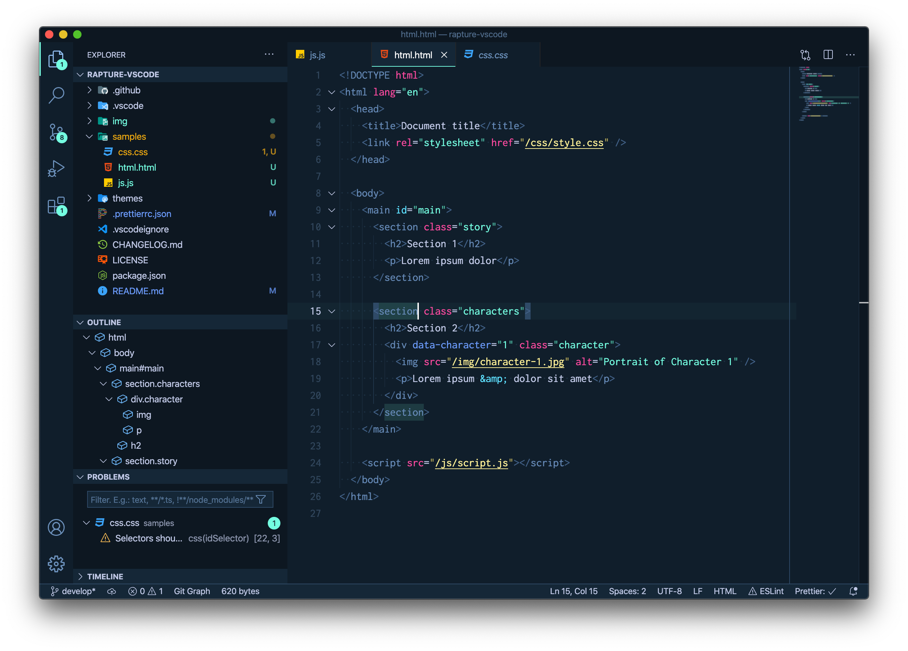
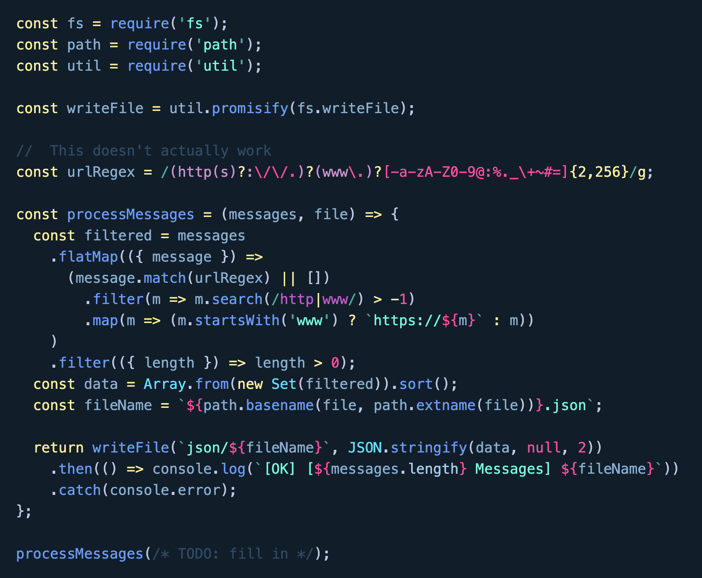
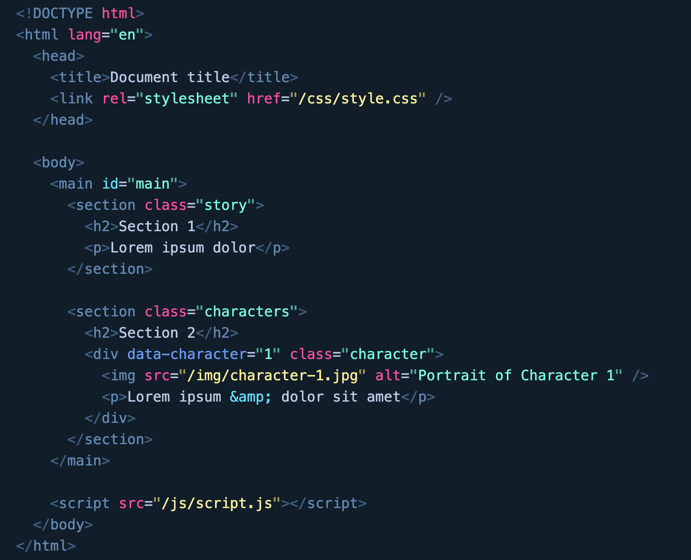
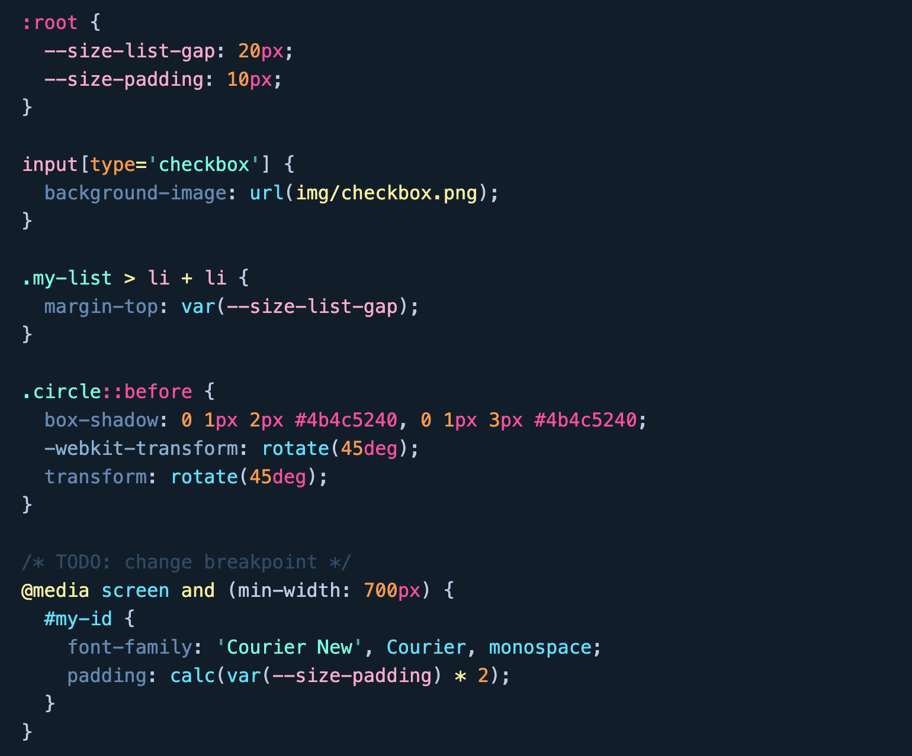

# Rapture Theme for VSCode

> A dark blue theme with bright accents inspired by the fictional city of Rapture

## Screenshots

### Editor

---

### JavaScript

---

### HTML

---

### CSS

## Font

The font used in the screenshots is [Inconsolata](https://levien.com/type/myfonts/inconsolata.html)

## Supported applications

Also available for:

- [iTerm2](https://github.com/mbadolato/iTerm2-Color-Schemes#rapture)

## Credits

Thanks to [RockLou](https://www.deviantart.com/rocklou) for the awesome logo, taken from [his wallpaper](http://fav.me/d9mvgz7)

## Contributing

Found an issue? Your favourite language doesn't look right? Feel free to [open an issue on GitHub](https://github.com/Pustur/rapture-vscode/issues)!

## Changelog

[CHANGELOG](CHANGELOG.md)

## License

[MIT](LICENSE)
